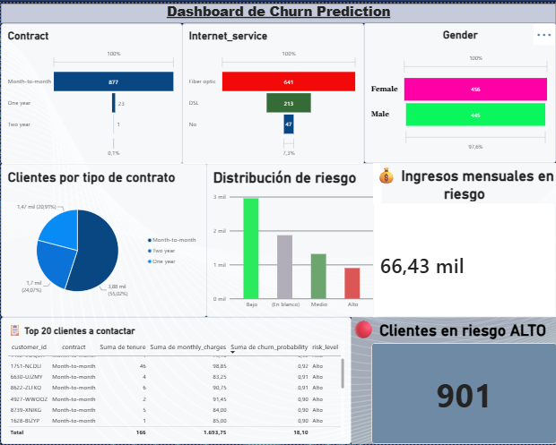

#  Churn Prediction ML Pipeline

Pipeline end-to-end para predecir abandono de clientes usando Python, SQL, n8n y Power BI.
## 📸 Vista previa del Dashboard

##  Stack Tecnológico
- **n8n**: Automatización de ingesta
- **PostgreSQL**: Almacenamiento de datos
- **Python**: Machine Learning (scikit-learn / XGBoost)
- **Power BI**: Visualización

##  Estructura del Proyecto
- `automation/`: Workflows de n8n
- `python/`: Scripts de ML
- `sql/`: Scripts de base de datos
- `bi/`: Reportes de Power BI
- `data/`: Datos (no subidos por tamaño)
- `docs/`: Documentación

## 🚧 Estado
En desarrollo 🚀

##  Autor
Oscar Oviedo  - [www.linkedin.com/in/oscar-alejandro-oviedo-alarcón-422b25257]